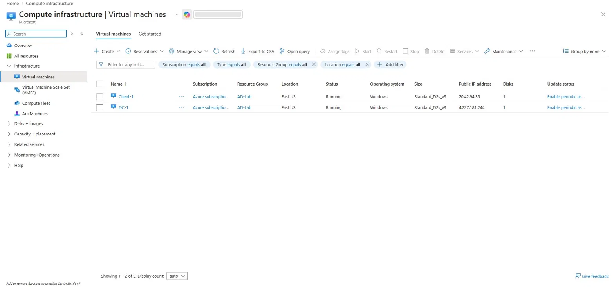

# Active-Directory-Implementation-in-Azure

---

## Project Summary

**Type:** Technology Implementation / Walkthrough

This project demonstrates the end-to-end deployment and configuration of an on-premises-style Active Directory environment hosted entirely in Microsoft Azure. Two Azure Virtual Machines are provisioned — one acting as a Windows Server 2022 Domain Controller (DC-1) and one as a Windows 11 client machine (Client-1). Active Directory Domain Services (AD DS) is installed, a domain is created, and the client machine is joined to the domain. Organizational Units, user accounts, and admin accounts are configured and demonstrated throughout.

**Languages Used:**
- PowerShell (user account creation, automation scripts)

**Environments Used:**
- Microsoft Azure (Cloud Platform)
- Windows Server 2022 (Domain Controller VM — DC-1)
- Windows 11 Pro (Client VM — Client-1)

**Technology / Applications / Services Used:**
- Azure Virtual Machines
- Azure Virtual Network (VNet)
- Active Directory Domain Services (AD DS)
- DNS (Windows Server)
- Remote Desktop Protocol (RDP)
- PowerShell ISE

---

## Environments and Technologies Used

| Component | Details |
|---|---|
| Cloud Provider | Microsoft Azure |
| Domain Controller OS | Windows Server 2022 Datacenter |
| Client OS | Windows 11 Pro |
| VM Size | Standard_D2s_v3 |
| Networking | Azure Virtual Network (AD-VNet) / subnet 10.0.0.0/24 |
| Resource Group | AD-Lab |
| Region | East US |

---

## Operating Systems Used

- **Windows Server 2022** — Domain Controller (DC-1)
- **Windows 11 Pro** — Client Machine (Client-1)

---

## High-Level Deployment and Configuration Steps

1. Deploy Domain Controller VM (DC-1) in Azure and set static private IP
2. Deploy Client VM (Client-1) on the same VNet
3. Install Active Directory Domain Services on DC-1
4. Promote DC-1 to a Domain Controller and create a new forest (`mydomain.com`)
5. Create Organizational Units (`_ADMINS`, `_EMPLOYEES`) and admin user account
6. Create bulk domain users with PowerShell
7. Configure Client-1 DNS to point to DC-1's private IP
8. Join Client-1 to the domain
9. Verify Client-1 appears in ADUC
10. Log into Client-1 as a domain user via RDP

---

## Demonstration

### Part 1: Azure Resource Setup

**Step 1 — Deploy Both VMs in Azure**

Two Virtual Machines are created in the same Resource Group (`AD-Lab`) and VNet (`AD-VNet`) in East US — `DC-1` (Windows Server 2022) and `Client-1` (Windows 11 Pro). Both show **Status: Running**.

---

**Step 2 — Set DC-1's Private IP to Static**

Navigate to DC-1's NIC → IP Configurations → Edit → set Allocation to **Static**. DC-1's private IP is locked to `10.0.0.4` so Client-1 can always resolve DNS to it.

---

### Part 2: Installing Active Directory

**Step 3 — Promote DC-1 to Domain Controller**

After installing the AD DS role via Server Manager, the promotion wizard is launched. **Add a new forest** is selected and the root domain name is set to `mydomain.com`.

---
**Step 4 — AD DS Installation**
After launching the VM, the server manager dashboard will automatically open and from there you click "Add roles & features", navigate to role-based or feature-based installation → select a server from the server pool → click "Active Directory Domain Services" → Install and Restart.

**Step 5 — AD DS Installation Confirmed**

After the server restarts, Server Manager Dashboard shows **AD DS** and **DNS** roles installed and healthy (all green).

---

### Part 3: Creating Organizational Units and Users

**Step 5 — Create OUs in ADUC**

Active Directory Users and Computers is opened. Two new Organizational Units are created under `mydomain.com`: `_EMPLOYEES` and `_ADMINS`.

---

**Step 6 — Create a Domain Admin Account**

A new admin user `mike_admin` (Michael King) is created inside the `_ADMINS` OU. After creation, this account is added to the **Domain Admins** security group and used for all subsequent admin tasks.

---

**Step 7 — Create Bulk Users with PowerShell**

PowerShell ISE is opened as Administrator. A script is run to automatically create domain user accounts (`abell`, `bclark`, `cdiaz`) in the `_EMPLOYEES` OU with a standard password.

---

**Step 8 — Verify Users in ADUC**

The `_EMPLOYEES` OU is selected in ADUC and the newly created users (`abell`, `bclark`, `cdiaz`) are confirmed present and enabled.

---

### Part 4: Joining Client-1 to the Domain

**Step 9 — Set Client-1 DNS to DC-1's Private IP**

In the Azure Portal, Client-1's NIC DNS settings are changed from **Inherit from virtual network** to **Custom**, pointing to `10.0.0.4` (DC-1's static private IP). This is required for Client-1 to locate the domain controller.

---

**Step 10 — Join Client-1 to the Domain**

After restarting Client-1, the Computer Name/Domain Changes dialog confirms the machine is joined to `mydomain.com`. The full computer name shows `Client-1.mydomain.com`.

---

**Step 11 — Verify Client-1 in ADUC**

Back on DC-1, the **Computers** container in ADUC shows `Client-1` listed as a Computer object, confirming successful domain join.

---

### Part 5: Logging in as a Domain User

**Step 12 — RDP into Client-1 as a Domain User**

Remote Desktop Connection is used to connect to Client-1's public IP (`20.42.94.35`) with the domain user account `mydomain.com\abell`.

---

**Step 13 — Domain User Successfully Logged In**

Client-1's System → About page confirms the machine is logged in as `abell@mydomain.com`, the full device name is `Client-1.mydomain.com`, and the OS is Windows 11 Pro — proving end-to-end Active Directory authentication is working.

---

## Key Takeaways

- Azure Virtual Machines can replicate on-premises Active Directory infrastructure entirely in the cloud
- Setting a **static private IP** on the Domain Controller before promotion is critical — a dynamic IP breaks DNS and domain joins
- The Client VM's **DNS must point to the Domain Controller** (not Azure's default DNS) for domain join to succeed
- PowerShell dramatically speeds up bulk user provisioning and is a critical real-world sysadmin skill
- Organizational Units provide a structured way to apply Group Policy and manage users at scale
- The `_ADMINS` OU pattern separates admin accounts from standard users — a best practice in enterprise AD environments

---

## Skills Demonstrated

- Azure VM provisioning and networking configuration
- Static IP assignment on Azure NICs
- Active Directory Domain Services installation and promotion
- DNS configuration in a cloud environment
- Organizational Unit and user account management in ADUC
- Domain admin account creation and group membership
- PowerShell scripting for bulk user automation
- Remote Desktop Protocol (RDP) administration
- Client VM domain join and verification
